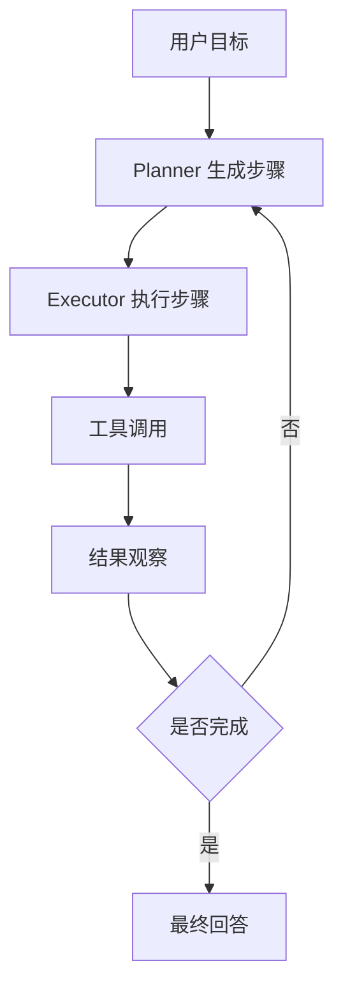

# Agent 开发范式面试题

## 1. 什么是 Agent？

Agent 是以 LLM 为推理核心，能够感知上下文、规划任务、调用工具、观察结果并迭代完成目标的系统。

一个工程化 Agent 通常包含：

* LLM 推理层
* Prompt/指令层
* 工具调用层
* 记忆/上下文层
* 状态机/工作流层
* 评测与观测层
* 权限与安全层

## 2. ReAct 范式是什么？

ReAct = Reasoning + Acting。

流程：

```text
Thought -> Action -> Observation -> Thought -> Action -> Observation -> Final
```

优点：

* 适合需要多步推理和工具调用的问题。
* 每一步都能根据工具反馈修正策略。
* 可解释性较强。

缺点：

* token 消耗高。
* 多轮调用延迟高。
* 如果没有约束，容易循环调用或调用错误工具。

## 3. Plan-and-Execute 是什么？

先由规划器生成任务计划，再由执行器逐步执行。

适合场景：

* 长任务
* 多工具协作
* 任务之间存在依赖
* 需要进度追踪和失败恢复

典型结构：



## 4. Workflow Agent 和 Autonomous Agent 区别？

| 类型 | 特点 | 优点 | 风险 |
| --- | --- | --- | --- |
| Workflow Agent | 固定流程，LLM 只处理局部判断 | 稳定、可控、易上线 | 灵活性较低 |
| Autonomous Agent | LLM 自主规划和执行 | 灵活、泛化强 | 不稳定、成本高、难控 |

工程落地通常优先 Workflow Agent，再在关键节点引入 LLM 决策。

## 5. 工具调用怎么设计？

工具设计原则：

* 单一职责：一个工具只做一类明确事情。
* Schema 清晰：参数类型、枚举、必填字段要明确。
* 幂等优先：避免重复调用产生副作用。
* 权限隔离：高危工具必须审批或二次确认。
* 可观测：记录工具名、参数、耗时、结果和错误。

工具执行链路：

```text
LLM 生成 tool_call -> 参数校验 -> 权限判断 -> 执行工具 -> 结果压缩 -> 注入上下文 -> LLM 继续推理
```

## 6. Agent 记忆怎么做？

常见记忆：

* 短期记忆：当前会话上下文。
* 长期记忆：用户偏好、历史事实、业务状态。
* 工作记忆：当前任务计划、中间结果、待办事项。
* 语义记忆：向量库检索出来的相关知识。

落地建议：

* 不要把所有历史都塞进 prompt。
* 记忆需要抽取、去重、过期和权限控制。
* 重要记忆写入前最好让模型生成结构化摘要，并由规则校验。

## 7. 多 Agent 是否一定更好？

不一定。多 Agent 适合角色边界清晰、任务可拆分、需要互审的场景。

常见问题：

* 通信成本高。
* 责任边界模糊。
* 状态同步复杂。
* 更难评估和调试。

面试建议：先说明多 Agent 不是银弹，再给出适用场景，如代码审查、规划执行分离、专家协作、评审仲裁。
