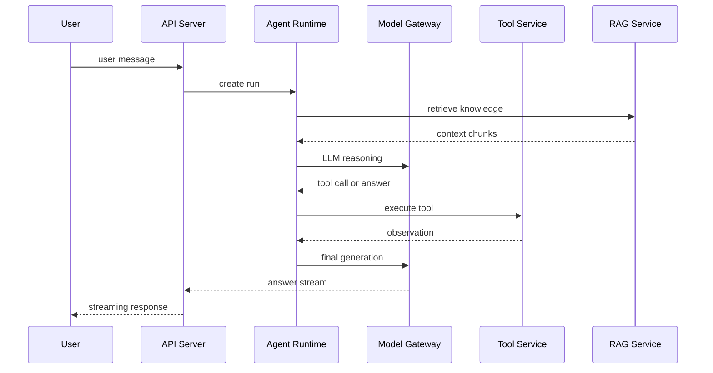

# Agent 后端常见面试题

## 一、系统设计

### 1. 如何设计一个 Agent 后端服务？

核心模块：

* API Gateway：鉴权、限流、路由。
* Session Service：会话、上下文、状态管理。
* Agent Runtime：规划、工具调用、模型调用。
* Tool Service：工具注册、执行、权限和审计。
* RAG Service：文档处理、检索、重排、引用。
* Model Gateway：模型路由、重试、降级、成本统计。
* Observability：日志、trace、指标、评测。

### 2. Agent 请求链路如何设计？

### 3. 如何做模型网关？

能力：

* 多模型适配，统一 API。
* 超时、重试、熔断、降级。
* 模型路由，按任务类型选择模型。
* token 统计和成本核算。
* Prompt 模板版本管理。
* 流式输出统一封装。

## 二、高并发与稳定性

### 1. 如何做限流？

常见算法：

* 固定窗口
* 滑动窗口
* 令牌桶
* 漏桶

Agent 场景通常按用户、租户、模型、工具维度组合限流。

### 2. 如何做重试？

原则：

* 只对幂等操作自动重试。
* 指数退避加 jitter。
* 区分 4xx 和 5xx。
* 对工具调用设置最大重试次数。
* 有副作用工具必须避免重复执行。

### 3. 如何做熔断和降级？

* 模型服务异常时切换备用模型。
* RAG 失败时降级为不带知识库回答，或提示无法查询资料。
* 工具失败时提供人工处理入口。
* 高峰期关闭低优先级功能，如复杂 rerank。

## 三、数据库与缓存

### 1. MySQL 索引为什么会失效？

常见原因：

* 对索引列使用函数或表达式。
* 隐式类型转换。
* `like '%xxx'` 前缀模糊。
* 联合索引不满足最左前缀。
* 低选择性字段不适合单独建索引。

### 2. Redis 常见数据结构和使用场景？

* String：缓存、计数器、分布式锁。
* Hash：对象缓存。
* List：简单队列。
* Set：去重、标签集合。
* ZSet：排行榜、延迟队列。
* Stream：消息流。

### 3. 缓存穿透、击穿、雪崩怎么处理？

* 穿透：缓存空值、布隆过滤器。
* 击穿：热点 key 互斥锁、逻辑过期。
* 雪崩：过期时间加随机值、多级缓存、限流降级。

## 四、消息队列

### 1. 为什么使用 MQ？

* 削峰填谷。
* 异步解耦。
* 失败重试。
* 事件驱动。
* 长任务后台化。

Agent 场景可用于文档入库、Embedding 生成、离线评测、异步工具执行。

### 2. 如何保证消息不丢？

* Producer confirm。
* Broker 持久化。
* Consumer ack。
* 失败重试和死信队列。
* 业务侧幂等处理。

### 3. 如何保证幂等？

* 请求唯一 id。
* 数据库唯一约束。
* Redis setnx。
* 状态机校验。
* 幂等表记录处理结果。

## 五、安全与权限

### 1. Agent 有哪些安全风险？

* Prompt Injection。
* 工具越权调用。
* 数据泄露。
* RAG 污染。
* SSRF / 任意文件读取。
* 代码执行风险。

### 2. 如何防 Prompt Injection？

* 系统指令和用户输入分层。
* 工具权限由后端判断，不交给模型。
* RAG 文档中的指令不应被当成系统指令。
* 对高危操作做二次确认。
* 输出和工具参数做安全校验。

### 3. 工具权限怎么设计？

* 工具分级：只读、写入、高危。
* 用户/租户级 ACL。
* 参数级权限校验。
* 高危操作审批。
* 全链路审计日志。

## 六、开放题回答模板

### 题目：你如何提升一个 Agent 系统的成功率？

回答结构：

1. 先建立评测集，定义成功率和失败类型。
2. 按链路拆分：意图识别、检索、工具调用、生成。
3. 针对召回失败优化 RAG，针对工具失败优化 schema 和校验。
4. 针对生成失败优化 prompt、few-shot 和模型选择。
5. 上线 trace 和用户反馈，持续回归评测。

### 题目：Agent 系统如何控制成本？

回答结构：

1. 模型路由，简单任务走小模型。
2. 压缩上下文和工具结果。
3. 缓存 embedding、检索结果和常见答案。
4. 限制最大轮数和工具调用次数。
5. 做 token 预算和租户级限额。
