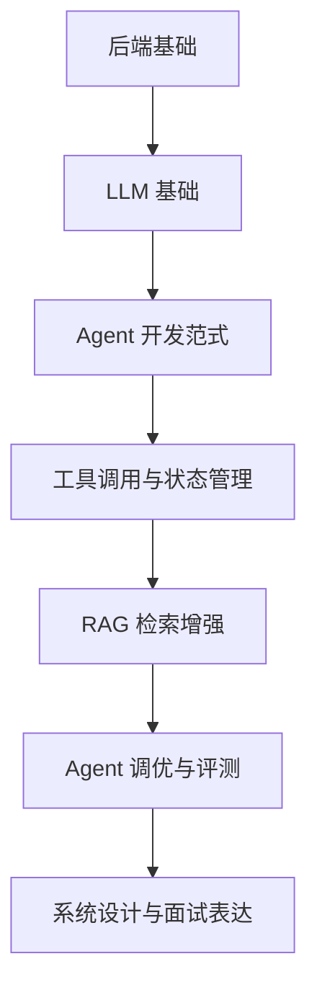

# Agent 后端开发面经

这是一份面向 Agent 后端开发岗位的面试复习目录，重点覆盖工程落地中常问的系统设计、调优、RAG、工具调用和后端基础。

> 注：Agent 岗位通常更常问 `LLM 基础`。如果面试 JD 明确写了 `LLVM`，可重点阅读编译器相关小节；否则建议把主要精力放在 LLM、Agent、RAG 和后端工程。

## 目录

* [LLM 与 LLVM 基础](./llm-llvm-basics)
* [Agent 开发范式](./agent-patterns)
* [Agent 开发调优](./agent-optimization)
* [RAG 落地与调优](./rag-optimization)
* [常见后端面试题](./backend-questions)

## 推荐复习路线

## 高频面试主线

面试官通常会沿着以下主线追问：

1. 你如何设计一个可上线的 Agent 后端系统？
2. 工具调用、记忆、上下文、权限和错误恢复如何做？
3. RAG 为什么效果不好？如何定位与优化？
4. 如何评估 Agent 的稳定性、成本、延迟和安全性？
5. 后端服务如何保证高并发、可观测、可扩展和数据一致性？
