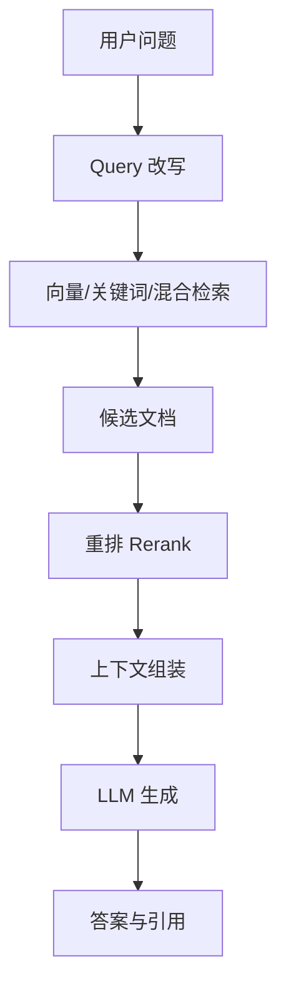

# RAG 落地与调优面试题

## 1. RAG 是什么？

RAG = Retrieval-Augmented Generation，检索增强生成。

流程：



## 2. RAG 为什么会答错？

常见原因：

* 文档未入库或入库失败。
* 文档切分不合理，语义被切断。
* Query 和文档表述差异大，召回不到。
* TopK 太小或太大。
* Embedding 模型不适合领域。
* 重排缺失或效果差。
* 上下文过长，模型忽略关键片段。
* 生成 prompt 没要求基于证据回答。

## 3. 文档切分如何设计？

切分策略：

* 按标题层级切分，保留章节路径。
* 按语义段落切分，避免硬切句子。
* 设置 overlap，缓解跨 chunk 信息丢失。
* 表格、代码、FAQ 使用专门解析方式。
* chunk 中保留 metadata，如来源、标题、时间、权限。

经验值：

* 通用知识：300-800 tokens/chunk。
* 技术文档：500-1200 tokens/chunk。
* QA/FAQ：一问一答为一个 chunk。

## 4. 向量检索和关键词检索怎么选？

| 检索方式 | 优点 | 缺点 |
| --- | --- | --- |
| 向量检索 | 语义匹配强 | 精确词、编号、术语可能弱 |
| BM25/关键词 | 精确匹配强 | 同义表达召回弱 |
| 混合检索 | 兼顾语义和精确匹配 | 系统复杂度更高 |

工程中常用 Hybrid Search：向量召回 + BM25 召回 + Rerank。

## 5. Rerank 有什么作用？

向量检索负责从大规模文档中快速召回候选，Rerank 负责更精细地判断 query 和文档的相关性。

常见方案：

* Cross-Encoder Reranker
* LLM Rerank
* 规则加权，如标题、时间、权限、文档类型

## 6. Query 改写有什么用？

用于缓解用户问题短、不完整、口语化的问题。

常见方式：

* 补全上下文指代。
* 提取关键词。
* 生成多个检索 query。
* 将问题改写为文档可能出现的表达。

风险：改写过度会偏离原问题，所以最好保留原 query 与改写 query 一起检索。

## 7. 上下文如何组装？

原则：

* 相关性高的片段靠前。
* 保留来源、标题、章节层级。
* 去重相似 chunk。
* 控制总 token 长度。
* 对长文档先摘要再注入。

Prompt 约束：

```text
请只基于给定资料回答。
如果资料不足，请回答“资料不足，无法确定”。
回答中给出引用来源。
```

## 8. RAG 如何评测？

评测指标：

* Recall@K：标准证据是否被召回。
* MRR/NDCG：相关文档排序是否靠前。
* Faithfulness：答案是否忠实于证据。
* Answer Correctness：答案是否正确。
* Citation Accuracy：引用是否准确。
* Latency / Cost：延迟和成本。

调优闭环：

```text
收集失败问题 -> 判断召回失败还是生成失败 -> 调整切分/检索/重排/prompt -> 回归评测
```

## 9. RAG 和 Agent 如何结合？

常见模式：

* RAG 作为 Agent 的一个知识工具。
* Agent 根据问题类型选择不同知识库。
* 多轮任务中，Agent 先检索，再调用业务工具验证。
* 对复杂问题做多跳检索和计划式检索。
