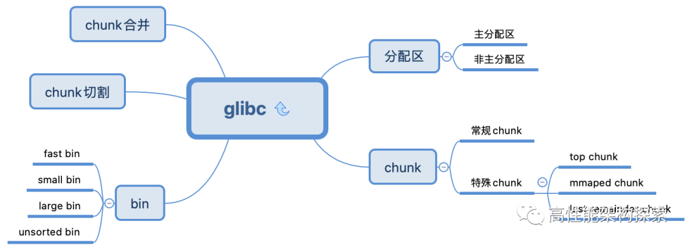
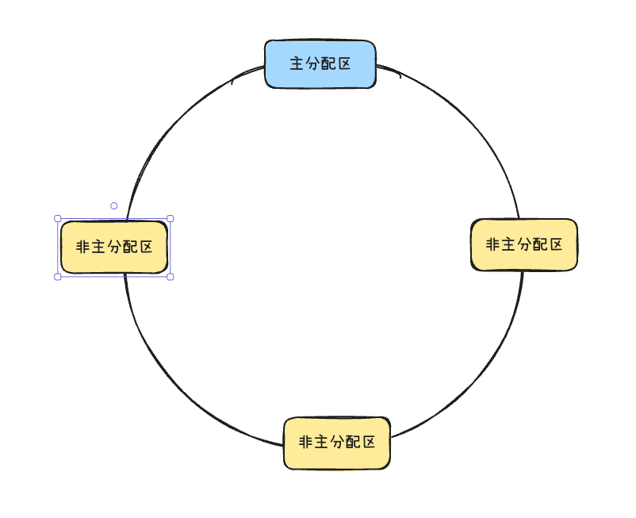
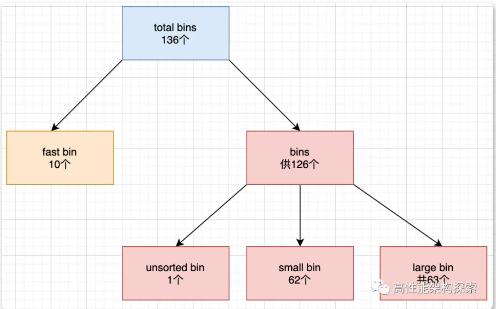

# Glibc内存管理解析（ptmalloc）

## 整体脉络



这里偷一下大佬的图，这就是本文需要去探讨的内容。

## 基础概念

**Arena（分配区）**

在ptmalloc中分为主分配区（Arena）和非主分配区（NArena），区别在于主分配区用brk和mmap向OS申请内存，而非主分配区只能用mmap。

当一个线程调用malloc时，分配器会先检查当前线程的私有变量是否已经存在一个分配区（就近使用原则），如果有，则尝试加锁，加锁成功就从该分配区中分配内存。如果加锁失败，会在环形列表中去寻找一个未加锁的Arena，如果找不到就尝试开辟一个新的Arena，并加入环形列表。

当然，之前在演化篇说过，这种开辟不是无上限的，因为开辟了就不会释放，是跟系统有关系。

**堆管理结构**

```C
struct malloc_state {
 mutex_t mutex;                 /* Serialize access. */
 int flags;                       /* Flags (formerly in max_fast). */
 #if THREAD_STATS
 /* Statistics for locking. Only used if THREAD_STATS is defined. */
 long stat_lock_direct, stat_lock_loop, stat_lock_wait;
 #endif
 mfastbinptr fastbins[NFASTBINS];    /* Fastbins */
 mchunkptr top;
 mchunkptr last_remainder;
 mchunkptr bins[NBINS * 2];
 unsigned int binmap[BINMAPSIZE];   /* Bitmap of bins */
 struct malloc_state *next;           /* Linked list */
 INTERNAL_SIZE_T system_mem;
 INTERNAL_SIZE_T max_system_mem;
 };
```

每个进程都有一个主分配区，由main线程来创建和持有，主分配区和非主分配区间用一个环形列表来链接。



**Chunk**

ptmalloc使用malloc_chunk来管理内存，在user payload中存储信息，并记录下边界信息。chunk 定义如下：

```
struct malloc_chunk {  
  INTERNAL_SIZE_T      prev_size;    /* Size of previous chunk (if free).  */  
  INTERNAL_SIZE_T      size;         /* Size in bytes, including overhead. */  
  
  struct malloc_chunk* fd;           /* double links -- used only if free. */  
  struct malloc_chunk* bk;  
  
  /* Only used for large blocks: pointer to next larger size.  */  
  struct malloc_chunk* fd_nextsize;      /* double links -- used only if free. */  
  struct malloc_chunk* bk_nextsize; 
};  
```

+ prev_size: 前一个相邻chunk的大小，根据这个size和当前chunk的地址就能得到上一个chunk的地址，用于空闲chunk合并
+ size：当前chunk的大小，包括一些头信息
+ fd/bk：当chunk在空闲链表中时有用
+ fd_nextsize/bk_nextsize: large bin情况下使用

> 这里和普通的程序不同，为了节省内存，当chunk中这些在free或large bin情况下才有意义的变量空间也会用于储存荷载。

**空闲链表**（bins）

内存释放时，ptmalloc不会立即把内存返回系统，而是加入到空闲链表中，下次再申请时可以重复利用，避免系统调用。

ptmalloc中会把不同大小的chunk分类串起来，一般根据大小可以分为samll bin、fast bin、large bin、unsorted bin

