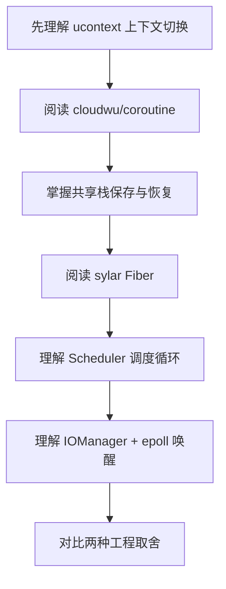

# coroutine 与 sylar 协程实现设计分析

本文是源码分析系列目录，围绕 [cloudwu/coroutine](https://github.com/cloudwu/coroutine) 与 [sylar-yin/sylar](https://github.com/sylar-yin/sylar) 的协程实现展开。

## 系列文章

* [cloudwu/coroutine 共享栈协程设计解析](./coroutine/cloudwu)
* [sylar Fiber/Scheduler/IOManager 协程运行时设计解析](./coroutine/sylar)
* [cloudwu/coroutine 与 sylar 协程实现对比](./coroutine/compare)

## 阅读路线

如果你只想理解协程本质，建议先读 cloudwu/coroutine；如果你更关注服务器框架如何落地协程运行时，建议重点读 sylar。
