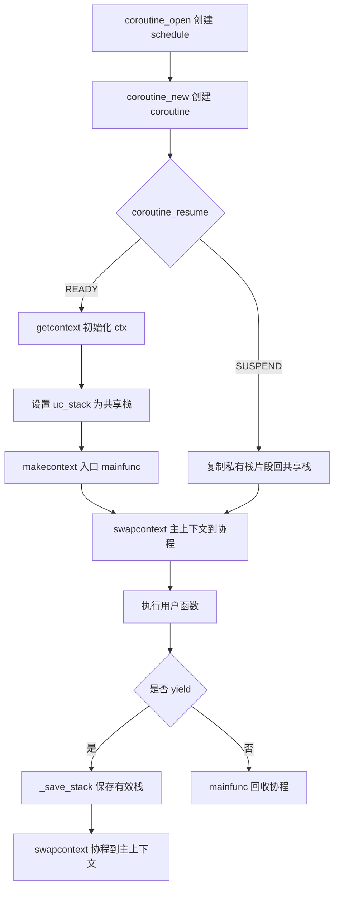

# cloudwu/coroutine 共享栈协程设计解析

[cloudwu/coroutine](https://github.com/cloudwu/coroutine) 是一个极简 C 协程库。它用很少的代码实现了用户态协程的核心闭环：创建协程、恢复协程、主动让出、保存栈、恢复栈和生命周期回收。

## 设计架构

核心只有两个结构：

* `schedule`：一个线程内的协程调度器，保存共享栈、主上下文、协程数组和当前运行 id。
* `coroutine`：单个协程对象，保存用户函数、参数、上下文、状态和挂起时复制出来的私有栈片段。

```c
struct schedule {
    char stack[STACK_SIZE];
    ucontext_t main;
    int nco;
    int cap;
    int running;
    struct coroutine **co;
};

struct coroutine {
    coroutine_func func;
    void *ud;
    ucontext_t ctx;
    struct schedule * sch;
    ptrdiff_t cap;
    ptrdiff_t size;
    int status;
    char *stack;
};
```

架构特点：

* 单线程协作式调度，不做抢占。
* 所有协程运行时共用 `schedule.stack`。
* 协程挂起时，只把实际使用的栈片段复制到堆上。
* 协程恢复时，再把保存的栈片段复制回共享栈。
* 状态机很小：`READY / RUNNING / SUSPEND / DEAD`。

## 运行流程



## 共享栈实现思路

传统独立栈协程会给每个协程分配一段栈空间。如果协程数量很大，即使多数协程只使用很少栈，也会带来较高内存占用。

`cloudwu/coroutine` 采用共享栈：

* 调度器只有一块 1MB 的 `schedule.stack`。
* 任意时刻只有一个协程运行，因此这块栈可以被所有协程复用。
* 协程挂起前，将当前栈帧到共享栈顶部之间的有效内容复制出来。
* 协程恢复前，将这段内容复制回共享栈相同位置。

这个方案用栈拷贝换取内存节省，非常适合大量协程但单个协程挂起时栈占用较小的场景。

## 关键函数解析

### `coroutine_open`

创建调度器，初始化协程数组、容量和当前运行状态。

关键点：

* `running = -1` 表示当前没有协程正在运行。
* 初始容量是 `DEFAULT_COROUTINE`。
* `co` 数组按协程 id 索引。

### `coroutine_new`

创建协程并返回 id。

实现逻辑：

* `_co_new` 分配并初始化 `coroutine`。
* 如果协程数量达到容量上限，扩容为 2 倍。
* 否则寻找空槽位保存协程。

协程结束后对应槽位会被置空，因此 id 可以复用。

### `coroutine_resume`

恢复指定协程执行，是整个库的入口函数。

`COROUTINE_READY` 分支处理首次运行：

* `getcontext(&C->ctx)` 初始化上下文。
* `C->ctx.uc_stack.ss_sp = S->stack` 指向共享栈。
* `C->ctx.uc_link = &S->main` 设置协程返回后的目标上下文。
* `makecontext` 设置入口为 `mainfunc`。
* `swapcontext(&S->main, &C->ctx)` 切入协程。

`COROUTINE_SUSPEND` 分支处理恢复运行：

* `memcpy` 将 `C->stack` 复制回共享栈尾部。
* 状态改为 `RUNNING`。
* `swapcontext` 切回协程保存的上下文。

### `_save_stack`

保存当前协程实际使用的共享栈片段。

```c
char dummy = 0;
assert(top - &dummy <= STACK_SIZE);
C->size = top - &dummy;
memcpy(C->stack, &dummy, C->size);
```

`dummy` 是当前函数调用栈上的局部变量。常见平台栈向低地址增长，`top` 是共享栈高地址端，因此 `top - &dummy` 就是当前实际使用的栈空间。

### `coroutine_yield`

当前协程主动让出执行权。

步骤：

* 根据 `S->running` 找到当前协程。
* 调用 `_save_stack` 保存有效栈片段。
* 状态改为 `COROUTINE_SUSPEND`。
* `running` 重置为 `-1`。
* `swapcontext(&C->ctx, &S->main)` 回到主上下文。

### `mainfunc`

所有新协程的统一入口。

它根据 `S->running` 找到当前协程，调用用户函数。用户函数返回后，说明协程生命周期结束，`mainfunc` 会释放协程对象、清空数组槽位、减少协程计数并重置运行状态。

## 原理探究

这个库中实现主要依赖 ucontext库，该库是早期Linux提供的用户态上下文切换库。

理解这个库之前，我们需要先理解一个线程的执行状态。

线程的执行状态由 CPU寄存器、RIP（PC指针）、RSP（SP指针）、RPB 、RAX～R15 + 栈空间组成，将这些信息的集合称为context（上下文）。如果能把这些信息记录下来，那么就可以实现协程的切换。

核心数据结构：

```C
typedef struct ucontext {
   sturct ucontext *uc_link;      // 切换到哪个协程
   sigset_t uc_sigmask;
   stack_t uc_stack;             // 栈指针
   mcontext_t uc_context;        // 寄存器状态
}ucontext_t;

struct uc_stack{
 void* ss_sp; // 栈顶指针
 size_t ss_size;	
}
```

重要函数

1. getcontext(context_t* ucp)

   获取当前的上下文，保存当前的寄存器、栈指针、RIP、信号屏蔽字。执行完之后uc p中就保存了当前的执行状态

2. setcontext(context_t* ucp)

   恢复执行现场，会将ucp中的状态设置到为当前的执行状态，从而实现执行。这里比较特殊的是setcontext后就不会正常返回了，因为已经改变了PC指针

3. makecontext()

   它不是保存当前现场，而是先构造一个将要进入的现场。典型使用方式：

   ```
   getcontext(&ctx);
   ctx.uc_stack.ss_sp = stackl
   ctx.uc_stack.ss_size = size;
   ctx.uc_link = &main_ctx;
   makecontext(&ctx,func, 0);
   ```

4. swapcontext(ucontext_t *old, ucontext_t *new)

   保存当前现场，切换到新现场

   

## 局限性分析

1. 性能问题：context库由于设计比较老且本身是为了signal、longjmp、exception recorver，不是为了协创，保存了太多不必要的状态（一些不重要的寄存器，事实上看，重要的就是RSP和RIP等）和信号量

2. ABI兼容问题：各个平台的寄存器数量规格不同、栈布局不同、调用约定不同，很难维护
3. 无法利用现代CPU的特性

## 小结

`cloudwu/coroutine` 的价值在于用最少概念呈现协程本质：上下文切换、状态机和栈保存。它不是完整运行时，但非常适合作为理解协程实现的第一份源码。
