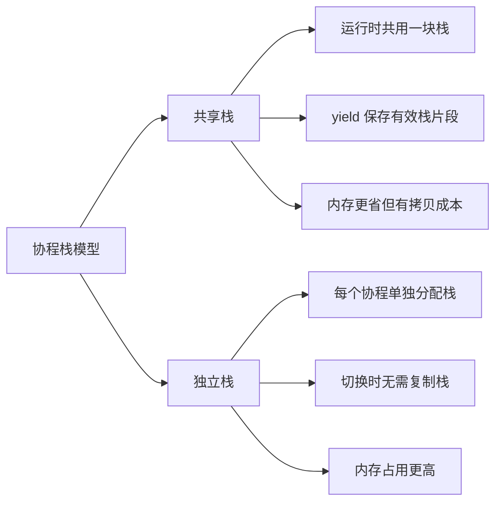

# cloudwu/coroutine 与 sylar 协程实现对比

`cloudwu/coroutine` 和 `sylar` 都基于 `ucontext` 完成用户态上下文切换，但它们面向的目标完全不同：前者是极简协程库，后者是服务器框架中的协程运行时。

## 核心差异

| 维度 | cloudwu/coroutine | sylar |
| --- | --- | --- |
| 语言 | C | C++ |
| 栈模型 | 共享栈，yield 时复制有效栈 | 独立栈，每个 Fiber 单独分配 |
| 调度模型 | 单线程手动 resume/yield | N-M 调度器，线程池执行协程 |
| IO 支持 | 无 | epoll + Timer + hook |
| 状态数量 | READY/RUNNING/SUSPEND/DEAD | INIT/HOLD/EXEC/TERM/READY/EXCEPT |
| 内存占用 | 低，大量协程更省栈内存 | 较高，但切换无需复制栈 |
| 复杂度 | 极低 | 较高 |
| 适用场景 | 学习、轻量嵌入 | 网络服务器、异步 IO 框架 |

## 共享栈 vs 独立栈



`cloudwu/coroutine` 的共享栈方案更像一个精巧的底层机制：它证明了协程不一定需要为每个实例保留完整栈空间。

`sylar` 的独立栈方案更接近工程运行时：切换路径更直接，也更容易与调度器、IO 等模块组合。

## 调度能力对比

`cloudwu/coroutine` 的调度由使用者显式控制：

```c
coroutine_resume(S, id);
coroutine_yield(S);
```

它不关心任务队列，也不关心 IO 事件，只负责在主上下文和协程上下文之间切换。

`sylar` 的调度器则负责：

* 接收协程和函数任务。
* 在线程池中分发任务。
* 根据协程状态决定是否重新入队。
* 无任务时进入 idle 协程。
* 与 IOManager 配合，在 IO 就绪后恢复协程。

## IO 能力对比

`cloudwu/coroutine` 没有 IO 调度能力。如果协程中调用阻塞 IO，会阻塞整个线程。

`sylar` 通过 `IOManager` 解决这个问题：

* fd 事件注册到 epoll。
* 当前协程 yield。
* epoll 事件到达后，`FdContext::triggerEvent` 将协程重新 schedule。
* hook 层把阻塞系统调用改造成协程挂起。

因此 sylar 可以支撑高并发网络服务。

## 如何选择

适合选择 `cloudwu/coroutine` 的情况：

* 想学习协程最小实现。
* 需要一个极轻量、可嵌入的 C 协程库。
* 协程数量多，但单个协程挂起时栈占用较小。

适合参考 `sylar` 的情况：

* 想实现网络服务器运行时。
* 需要多线程协程调度。
* 需要 IO 事件、定时器、hook 等工程能力。
* 希望业务层用同步写法编写异步 IO 逻辑。

## 总结

`cloudwu/coroutine` 适合理解“协程为什么能切换”和“共享栈如何保存恢复”。

`sylar` 适合理解“协程如何成为服务器框架运行时”，重点在调度器、IOManager、hook 与 Fiber 的组合。
