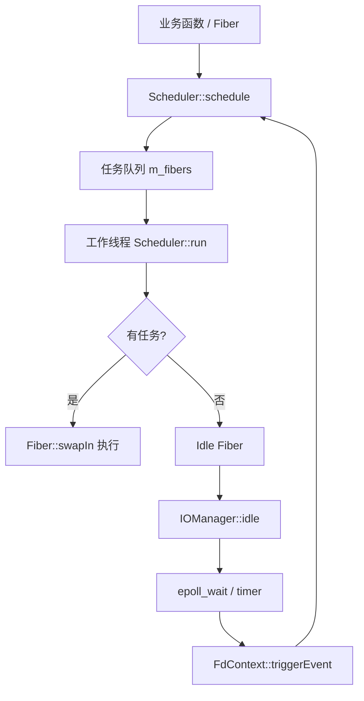
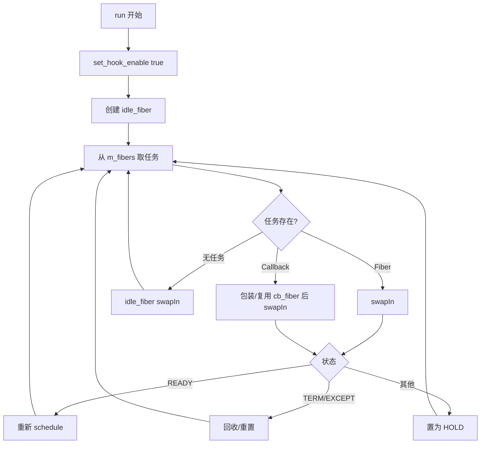

# sylar Fiber/Scheduler/IOManager 协程运行时设计解析

[sylar-yin/sylar](https://github.com/sylar-yin/sylar) 是一个 C++ 服务器框架。它的协程实现不止提供上下文切换，还包含调度器、线程池、IO 事件、定时器和 hook，目标是让业务代码用同步写法获得异步 IO 的性能。

## 总体架构

sylar 的协程体系可以分为三层：

* `Fiber`：协程抽象，封装 `ucontext_t`、独立栈、状态机和上下文切换。
* `Scheduler`：N-M 协程调度器，维护线程池和可运行任务队列。
* `IOManager`：继承 `Scheduler` 和 `TimerManager`，用 `epoll` 驱动 IO 协程恢复。



## Fiber 层

`Fiber` 的状态包括：

* `INIT`：初始化完成，尚未执行。
* `HOLD`：挂起，等待外部事件唤醒。
* `EXEC`：正在执行。
* `TERM`：执行结束。
* `READY`：可执行，等待调度。
* `EXCEPT`：执行异常。

与共享栈实现不同，sylar 为每个普通协程分配独立栈：

```cpp
m_stack = StackAllocator::Alloc(m_stacksize);
m_ctx.uc_stack.ss_sp = m_stack;
m_ctx.uc_stack.ss_size = m_stacksize;
```

这样切换时不需要复制栈，但每个协程都会长期占用自己的栈空间。

### 关键函数

#### `Fiber::Fiber()`

创建当前线程的主协程。主协程不分配独立栈，使用线程原生栈，并通过 `SetThis(this)` 设为当前协程。

#### `Fiber::Fiber(std::function<void()> cb, ...)`

创建普通业务协程：

* 分配独立栈。
* `getcontext` 初始化上下文。
* 设置 `uc_stack`。
* 根据 `use_caller` 选择入口 `MainFunc` 或 `CallerMainFunc`。

#### `Fiber::swapIn` / `Fiber::swapOut`

`swapIn` 从调度协程切入当前业务协程；`swapOut` 从当前业务协程切回调度协程。调度器随后根据协程状态决定是否重新入队。

#### `Fiber::YieldToReady` / `Fiber::YieldToHold`

* `YieldToReady`：让出后仍希望继续运行，状态改为 `READY`。
* `YieldToHold`：让出并等待事件，通常由 IO、定时器或外部逻辑唤醒。

#### `Fiber::MainFunc`

普通协程入口：执行业务回调，正常结束置为 `TERM`，异常置为 `EXCEPT`，最后 `swapOut` 回到调度协程。

## Scheduler 层

`Scheduler` 是 N-M 调度器：N 个线程调度 M 个协程或回调。

核心成员：

* `m_threads`：工作线程数组。
* `m_fibers`：待执行任务队列，任务可以是 `Fiber::ptr` 或 callback。
* `m_rootFiber`：当 `use_caller = true` 时，调用线程也作为调度线程。
* `m_activeThreadCount` / `m_idleThreadCount`：线程状态计数。

### 调度循环

`Scheduler::run` 是调度核心：



### `Scheduler::schedule`

将协程或函数加入任务队列。可指定线程 id，`-1` 表示任意线程。入队后如果需要唤醒空闲线程，会调用 `tickle`。

## IOManager 层

`IOManager` 在调度器基础上加入 epoll 和 timer。

关键设计：

* `epoll_create` 创建 epoll 实例。
* pipe 作为 tickle 机制，用于唤醒阻塞在 `epoll_wait` 的线程。
* `FdContext` 保存每个 fd 的 READ/WRITE 事件上下文。
* 事件上下文保存对应的 scheduler、fiber 或 callback。

### `IOManager::addEvent`

注册 fd 事件：

* 找到或扩容 `FdContext`。
* 根据已有事件选择 `EPOLL_CTL_ADD` 或 `EPOLL_CTL_MOD`。
* 使用 `EPOLLET` 边缘触发。
* 保存当前调度器。
* 如果传入 callback，则保存 callback；否则保存当前协程。

业务协程注册事件后通常会 yield。事件到达后，IOManager 再把它加入调度队列。

### `IOManager::idle`

空闲协程负责等待 IO：

* 根据最近定时器计算 `epoll_wait` 超时时间。
* 等待 fd 事件或 tickle pipe。
* 将过期定时器回调加入调度队列。
* 将 READ/WRITE 事件转换为协程或 callback 调度。
* 处理完后 `swapOut`，让调度器运行被唤醒的任务。

### `FdContext::triggerEvent`

触发某个 fd 事件：

* 从当前事件集合中移除该事件。
* 如果保存的是 callback，则调度 callback。
* 如果保存的是 fiber，则调度 fiber。
* 清理事件上下文。

## hook 的作用

`Scheduler::run` 会调用 `set_hook_enable(true)`。hook 层通常拦截 `sleep/read/write/connect` 等阻塞调用，把它们转换为协程友好的异步流程：

1. fd 设置为非阻塞。
2. 操作未就绪时注册 READ/WRITE 事件。
3. 当前协程 yield。
4. IO 就绪或超时后恢复协程。
5. 继续执行原系统调用。

这样业务代码看起来是同步阻塞写法，但实际阻塞的是协程而不是线程。

## 小结

sylar 的协程实现已经是工程化运行时：`Fiber` 解决执行上下文，`Scheduler` 解决任务分发，`IOManager` 解决 IO 等待和唤醒，hook 解决同步 API 到异步调度的转换。
